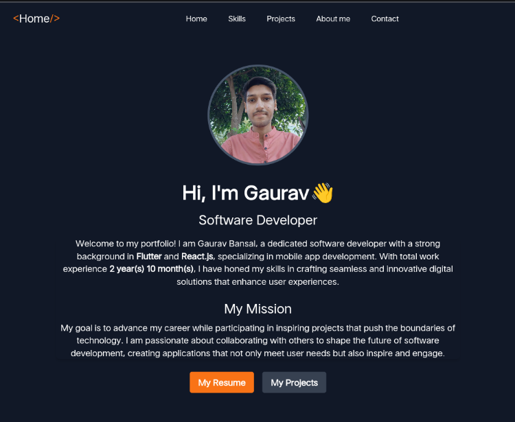

---

# Personal Portfolio ⚡

## Table of Contents 📑

- [Introduction](#introduction)
- [Key Features](#key-features)
- [Requirements](#requirements)
- [Installation](#installation)
- [Running the Project](#running-the-project)
- [Building for Production](#building-for-production)
- [Project Structure](#project-structure)
---

## Introduction 🚀

> A modern, ambient portfolio template, meticulously crafted for Software Developers to showcase their skills and projects with elegance.

> **Live Demo**: [gaurav-bansal.vercel.app](https://gaurav-bansal.vercel.app)


[](https://github.com/bansalgaurav852/gaurav.bansal/commits/master)
[](https://gaurav-bansal.vercel.app)

---

[](https://gaurav-bansal.vercel.app)

Explore the live version of the website and see it in action. If you find it useful, don't forget to leave a ⭐ on the repo!

---

## ⚙️ Key Features

- 🔥 **Open-Source**: Customize as per your needs.
- ⚛️ **Built with React & Tailwind CSS**: Clean and fast.
- ✨ **Easy Customization**: Modify it effortlessly.

---

## Requirements 📋

Before starting, ensure that you have the following installed on your local machine:

- **Node.js** (14.x or higher): [Install Node.js](https://nodejs.org/)
- **npm** (comes with Node.js):
  - To install npm: Included with Node.js installation

---

## Installation 🛠️

1. **Clone the repository**:
   Clone the project repository using Git:
   ```bash
   git clone <repository-url>
   cd <project-folder>
   ```

2. **Install project dependencies**: After cloning the repository, you need to install the required packages.

   ```bash
   npm install 
   ```

---

## Running the Project ▶️

To run the development server and start working on the project:

1. **Start the development server**:
   ```bash
   npm run dev
   ```

2. **Access the app**: Once the development server is up and running, open your browser and navigate to:

   ```
   http://localhost:5173
   ```

   Vite may automatically open the app in your default browser.

---

## Building for Production 📦

When you're ready to deploy your application, use the following command to create a production build:

```bash
npm run build
```

The built files will be stored in the **dist/** directory. You can deploy this directory to your preferred hosting service.

To test the production build locally, you can use the following command:

```bash
npm run preview
```

This will start a local server to preview the production build.

---

## Project Structure 🗂️

The project structure is organized as follows:

```perl
.
├── node_modules/       # All installed dependencies
├── public/             # Static files like images, fonts, etc.
├── src/                # Main source files for the project
│   ├── assets/         # Application assets such as images and icons
│   ├── components/     # React components of the app
│   ├── App.jsx         # Main App component
│   ├── main.jsx        # Entry point for the app
│   └── index.css       # Global styles
├── .gitignore          # Files to be ignored by Git
├── index.html          # HTML template for the app
├── package.json        # Project metadata and dependencies
├── vite.config.js      # Vite configuration
└── yarn.lock / package-lock.json  # Dependency lock file
```

---

Made with :heart: in India

---
